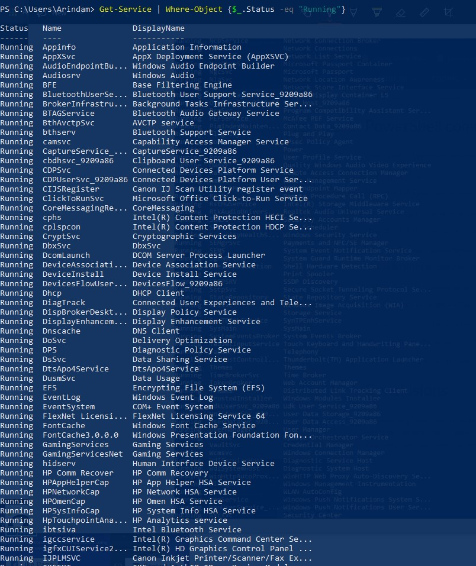
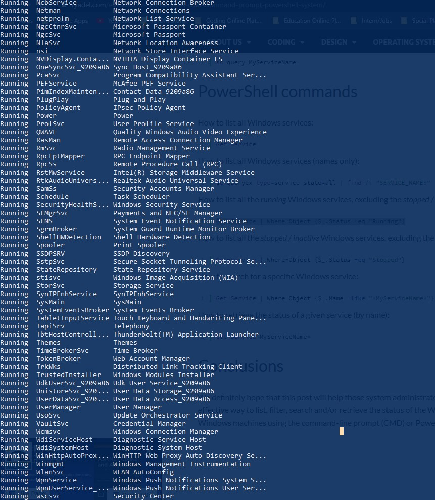

## 10 Daemons running in Windows 
Command for Windows :-
```
Get-Service | Where-Object {$_.Status -eq "Running"}
```
>

>

### 1.AppXSvc
AppX Developement Service
These services handle installing, removing, and updating Store apps, as well as ensuring they’re properly licensed.this process is used for installing, uninstalling, and updating Store apps. Windows automatically updates Store apps in the background, and many of the apps included with Windows—from Mail to Paint 3D—fall into this category.
### 2.Audiosrv
Windows Audio
AudioSrv.exe is not a Windows core file. AudioSrv.exe is able to monitor applications, record keyboard and mouse inputs and connect to the Internet
### 3.CIJSRegister
Canon IJ Scan Uitility register event
Canon IJ Scan Utility is the required scan and printer drivers as well as configuration and management utilities that comes with various Canon mutli-function devices. This utility also installed the network management tools used to connect the printer/scanner to the network.
### 4.DeciveInstall
Deveice Install serveice
When the Device Install Service is started, it is running as LocalSystem in a shared process of svchost.exe along with other services. If Device Install Service fails to start, the failure details are being recorded into Event Log.
### 5.EFS
encrypted file system
Provides the core file encryption technology used to store encrypted files on NTFS file system volumes. If this service is stopped or disabled, applications will be unable to access encrypted files.
### 6.EventLog
windows event log
Windows Event Log service maintains a set of event logs that the system, system components, and applications use to record events. The service exposes functions that allow programs to maintain and manage the event logs and perform operations on the logs, such as archiving and clearing. 
### 7.PEFService
antivirun service
The genuine PEFService.exe file is a software component of Intel IPMI by Intel.
Intel IPMI is a management and monitoring tool for large hardware-based systems. PEFService.exe runs the Platform Event Filtering service that automatically runs a group of actions when certain conditions have been met. Removing this file may cause issues while running IPMI.
### 8.SysMain
SysMain sits quietly in the background, constantly analyzing the use of RAM and finding out which applications you run most often. Over time, SysMain marks these applications as “frequently used” and preloads them into RAM. The idea is that when you want to start the application, it will start much faster, because it is already loaded into memory.
### 9.UserManager
User manager
User Manager provides the runtime components required for multi-user interaction. If this service is stopped, some applications may not operate correctly.
### 10.WlanSvc
WLAN autoconfig
The WLANSVC service provides the logic required to configure, discover, connect to, and disconnect from a wireless local area network (WLAN) as defined by IEEE 802.11 standards. It also contains the logic to turn your computer into a software access point so that other devices or computers can connect to your computer wirelessly using a WLAN adapter that can support this. Stopping or disabling the WLANSVC service will make all WLAN adapters on your computer inaccessible from the Windows networking UI. 