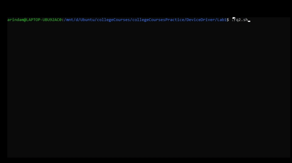

## Question 2
#
Write a shell program with at least 30 lines excluding comments. It can be ANY shell program.
Reason: To understand Bash/Shell commands and System Administrators control/install all DD only through shell scripts. 
(Approximate time taken - 3 hours, as you are new to shell programs) 
>[Solution](./q2.sh)

>

for installation of python library by checking if its there dont install else install the library [here](https://github.com/ArindamSharma/Image-Processing/blob/master/config-4.sh) is the script for it.
#