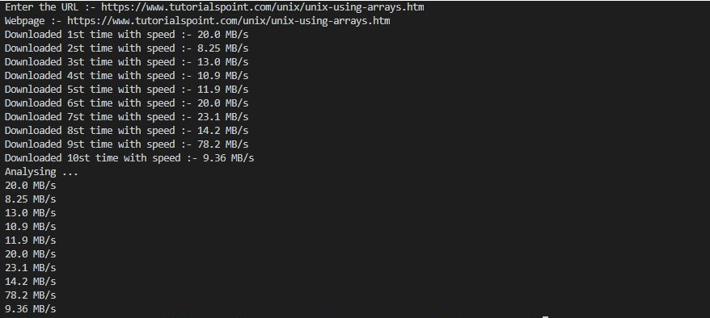

## Question 3
#
Write a Shell program to download a webpage, given url. And analyse download performance by running at different time of the day.
Reason: Same as above. All other lab exercises will be in C.
(Approximate time taken - 3 hours)  

this script will automatically run multiple times and analiyse the reuslt and dispay the output.there is no need to run the script multiple times.
>[Solution](./q3.sh)

>
#