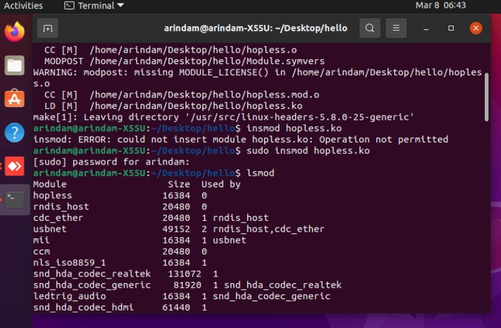
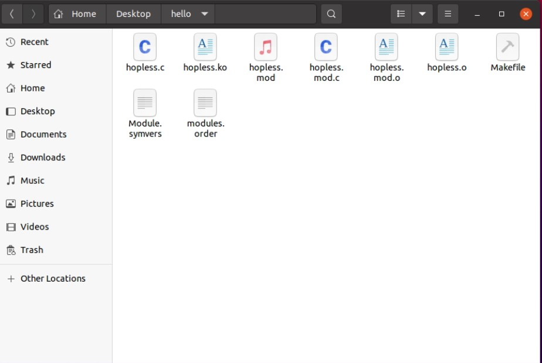

## Question 5
#
Write a C program, compile it as module, insert into kernel, check message in log, remove module from kernel.
>[Shell file](./q5.sh),[kernal Modules](./hello),[Make file](./hello/Makefile),[Module](./hello/hopless.c)

>
>
>
#