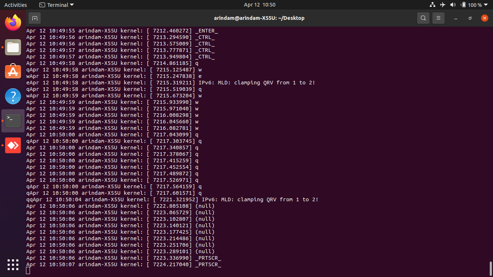

## Question 7
#
Write a C program, keyboard logger, to capture keyboard strokes, through which we can capture typed passwords.
>[Solution](./ex9.c),[Makefile](./Makefile),[Header File (kbduskeymap.h)](./kbduskeymap.h)

>
>
>
>
#