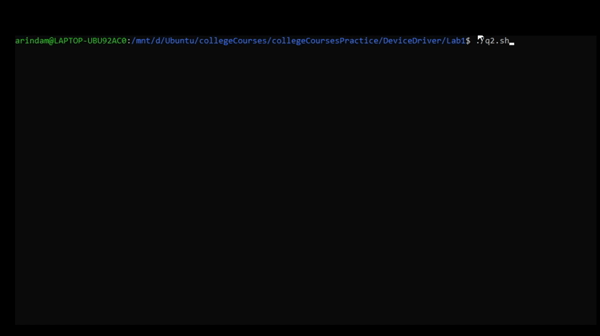
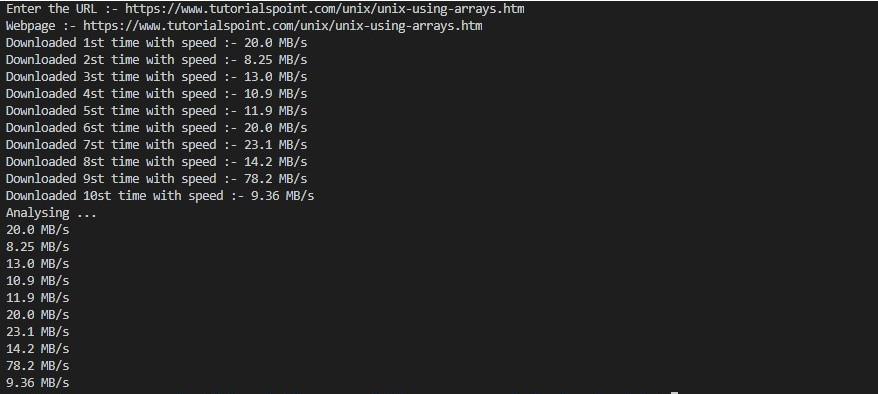

# Lab 1 
## Question 1
#
List at least 10 Daemons running in your machine and explain each in one or two lines (soft copy only, just text file).
Reason: To understand importance of Daemons as many DD are Daemons.
(Approximate time taken - 2 hours)
>[Solution](./q1.md)
#
## Question 2
#
Write a shell program with at least 30 lines excluding comments. It can be ANY shell program.
Reason: To understand Bash/Shell commands and System Administrators control/install all DD only through shell scripts. 
(Approximate time taken - 3 hours, as you are new to shell programs) 
>[Solution](./q2.sh)

>

for installation of python library by checking if its there dont install else install the library [here](https://github.com/ArindamSharma/Image-Processing/blob/master/config-4.sh) is the script for it.
#
## Question 3
#
Write a Shell program to download a webpage, given url. And analyse download performance by running at different time of the day.
Reason: Same as above. All other lab exercises will be in C.
(Approximate time taken - 3 hours)  

this script will automatically run multiple times and analiyse the reuslt and dispay the output.there is no need to run the script multiple times.
>[Solution](./q3.sh)

>
#
[Give Instruction And Questions](./questions.md)
